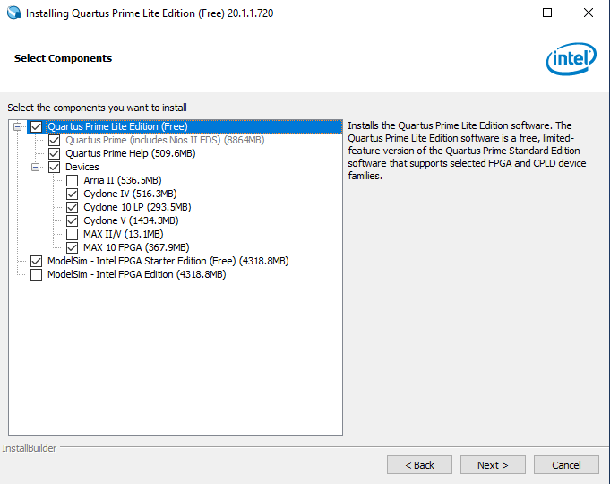

# Instalação do Quartus Prime no Windows

O Quartus Prime é a ferramenta para desenvolvimento da Intel para FPGAs. Através dela, é possível desenvolver circuitos digitais com o uso de diagramas de bloco, ou utilizando uma HDL -- Hardware Description Language, tal como VHDL ou (System)Verilog. A ferramenta possui suporte para os sistemas operacionais Windows ou Linux.

Segundo a [a página de suporte da Intel](https://www.intel.com/content/www/us/en/programmable/support/support-resources/download/os-support.html), as ferramentas de desenvolvimento para FPGA da Intel apresentam suporte para os seguintes versões do Windows:

- Windows 10
- Windows Server 2012
- Windows Server 2016
- Windows Server 2019

## Fazendo o Download da Ferramenta

Existem algumas versões do Quartus Prime, sendo a versão Pro a mais completa e a Lite a mais simplista. Neste tutorial, será apresentada a instalação da versão Lite, uma vez que esta é a única versão gratis. A ferramenta pode ser baixada no site da [Intel](https://www.intel.com/content/www/us/en/collections/products/fpga/software/downloads.html?edition=lite&platform=windows&s=Newest&f:guidetmD240C377263B4C70A4EA0E452D0182CA=%5BIntel®%20Quartus®%20Prime%20Design%20Software%3BIntel®%20Quartus®%20Prime%20Lite%20Edition%5D&f:os-rdc=%5BMicrosoft%20Windows*%5D).

Para realizar o download, é necessário uma conta no Programa de FPGAs Intel. A criação desta conta é gratuita, podendo ser realizada [neste link](https://www.intel.com/content/www/us/en/forms/fpga/fpga-individual-registration.html).

É recomendado que você realize o download da versão mais recente, desde que haja suporte para o seu dispositivo. Para a versão 20.1.1, escolhendo a opção de Arquivos Combinados (_Combined Files_), que possui o tamanho de 5.9 GB. Certifique-se de que o seu sistema atende aos requisitos mínimos para instalação [clicando aqui](https://www.intel.com/content/www/us/en/software-kit/660907/intel-quartus-prime-lite-edition-design-software-version-20-1-1-for-windows.html). Caso não atenda aos requisitos de hardware, selecione uma versão anterior (a 16.1, por exemplo). Eis aqui um resumo dos requisitos mínimos para simplificar:

- Espaço em disco: 14GB
- Entre 512MB e 2GB de RAM

## Instalação do Quartus Prime

Após o download do Quartus Prime, é a fez de realizar a instalação do sistema. Primeiramente, o arquivo baixado deve ser descompactado.

Na pasta `components`, estão os executáveis para a instalação do Quartus Prime. Você pode escolher executar os instaladores separadamente, lembrando-se de iniciar pelo _QuartusLiteSetup-20.1.1.720.exe_. Para executar a instalação completa, clique duas vezes no scripts _setup.bat_ e siga as instruções na tela.

Na tela inicial você deve aceitar a licença para a instalação do Quartus Prime. Após o termo de aceite, é hora de escolher a pasta onde o Quartus Prime será instalado. Recomendamos o uso da pasta `C:\intelFPGA\20.1.1`, muito parecida com a sugestão original, exceto pelo fato da pasta padrão ser chamada de `intelFPGA_lite`.

Agora escolha quais componentes serão instalados. Você pode escolher fazer a instalação de cada _software_ (_Quartus Prime, Quartus Help e ModelSim_) separadamente. Entretanto, para este tutorial vamos selecionar todos os componentes necessários. Você pode reduzir o tempo de instalação e o espaço ocupado em disco, retirando os _Devices_ não utilizados. Para nosso curso, precisaremos apenas do Cyclone IV. Certifique-se de selecionar a versão **Starter Edition** do ModelSim. A escolha dos componentes deve ser igual à imagem abaixo:



Após essa etapa, é necessário prosseguir com a instalação, aguardando a tela de confirmação. Chegando nesta tela, mantenha as caixas de seleção como está e pressione o botão _Finish_ para fechar a interface gráfica.

Finalmente, o processo de instalação do driver será inicializado. Deixe que ele termine e você terá finalizado a instalação do Quartus Prime.

Certifique-se de que a instalação foi bem sucedida, e na primeira execução selecione a opção _Run the Quartus Prime software_. Essa caixa de diálogo só aparecerá uma vez.

### Configurando o ambiente de simulação

Para podermos executar o ModelSim diretamente a partir do Quartus Prime e simular o funcionamento do nosso circuito, é necessário realizar uma configuração simples. Abra o Quartus Prime e acesse o painel `EDA Tool Options` acessado através do menu `Tools > Options` para especificar a localização do simulador. No campo ferente ao `ModelSim-Intel`, introduza o caminho onde se encontra o executável do ModelSim Intel FPGA Edition:

```<QUARTUS_INSTALL_DIR>/modelsim_ase/win32aloem

```


> Observe que existem duas referências ao **ModelSim**. Certifique-se de preencher a informação acima no campo **ModelSim-Altera**.

## Configurando o ambiente de linha de comando no PowerShell

Uma das grande vantagens das ferramentas de projeto FPGA é que elas podem ser facilmente integradas dentro de um fluxo de projeto, economizando tempo e aumenta a produtividade.

Além da interface gráfica comum, o Quartus Prime também possui uma série de executáveis por linha de comando. Esses programas permitem que você automatize o processo de síntese e teste dos circuitos sem necessitar abrir a interface gráfica.

Mais informações sobre como utilizar os scripts de linha de comando para acelerar sua produtividade podem ser encontradas [online](https://www.intel.com/content/dam/www/programmable/us/en/pdfs/literature/ug/ug-qps-scripting.pdf)

### Configurando as variáveis de ambiente do PowerShell

Desde a introdução do Windows 10, a Microsoft apresentou para a comunidade o [PowerShell](https://docs.microsoft.com/en-us/powershell/).

> 💬 _PowerShell is a cross-platform task automation and configuration management framework, consisting of a command-line shell and scripting language. Unlike most shells, which accept and return text, PowerShell is built on top of the .NET Common Language Runtime (CLR), and accepts and returns .NET objects. This fundamental change brings entirely new tools and methods for automation._

Dessa forma, os usuários do Windows podem agora tirar proveito de todo o poder dos _scripts_ de automação para desenvolver suas aplicações.

Para ser capaz de acessar aos executáveis do Quartus Prime e do ModelSim através da linha de comando o primeiro passo é incluir o caminho para os binários à variável de ambiente `PATH`. Para isso, você pode usar o comando:

```bash
$env:Path += ";C:\intelFPGA\20.1\quartus\bin64"
```

O mesmo deve ser feito para acessar aos comandos do ModelSim:

```bash
$env:Path += ";C:\intelFPGA\20.1\modelsim_ase\win32aloem"
```

Agora tente executar o comando `quartus_sh` no PowerShell. Se tudo correr bem, você deve visualizar uma mensagem padrão do Quartus Prime.

Nos nossos laboratórios, utilizaremos, além de scripts `TCL`, arquivos make (`Makefile`) para automatizar nosso fluxo de tarefas. Para instalar o make no Windows, você pode o [Make for Windows](http://gnuwin32.sourceforge.net/packages/make.htm). Em seguida, adicione o make à variável de ambiente `PATH`.

```bash
$env:Path += ";C:\Program Files (x86)\GnuWin32\bin"
```

Agora você poderá digitar simplesmente `make` na linha de comando, em um diretório que contenha um `Makefile`.

## Recursos

- [Intel® FPGA Software Installation and Licensing](https://www.intel.com/content/dam/www/programmable/us/en/pdfs/literature/manual/quartus_install.pdf)

- [Intel® Quartus® Prime Standard Edition User Guide: Scripting](https://www.intel.com/content/dam/www/programmable/us/en/pdfs/literature/ug/ug-qps-scripting.pdf)

- [Customizing your PowerShell Profile](https://www.howtogeek.com/50236/customizing-your-powershell-profile/)
